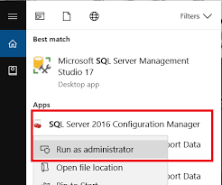
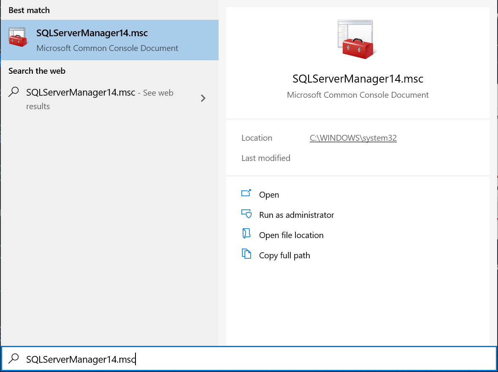
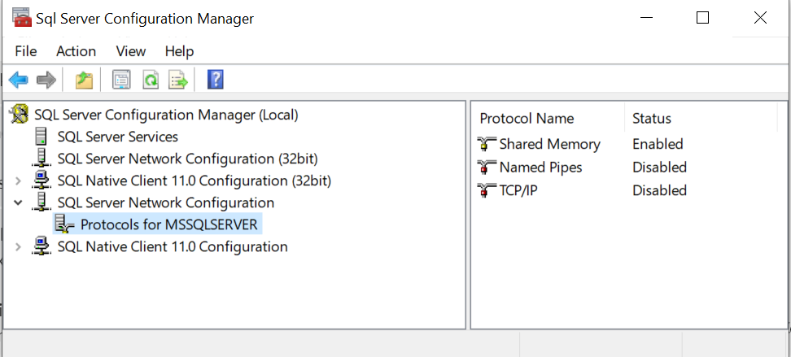
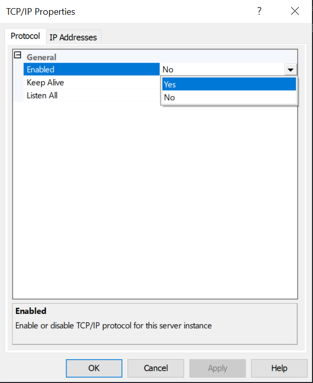
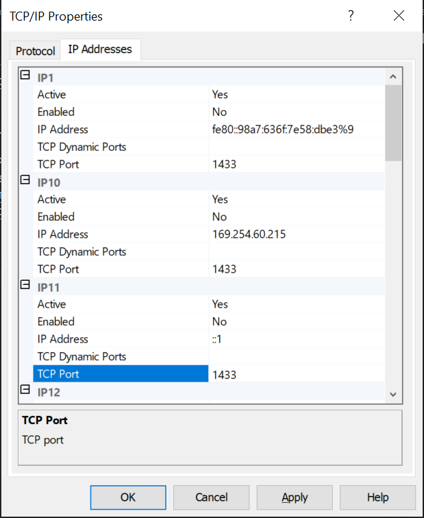
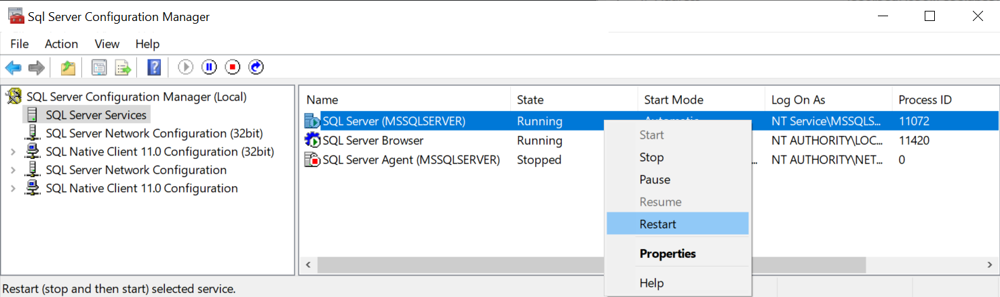

In this post, I will show you how to connect from an app running in a docker container to a local SQL express/server running in your machine.

> Please note that the SQL Server is not running inside a docker container but it is installed on my dev machine.

Recently, I was considering using the docker for my day to day development. So I can deploy all the services which are required in docker and keep them up all the time and only redeploy the changed services.

Deploying other app services is easy but things go complicated with the database. 

> Well not to mention that I could deploy a database in a docker container and use it instead but then I will be running one instance on my local machine and another on the container.

## What is the problem?

The docker container is running as a separate machine inside your host machine. Hence the Data Source=(local) or named server is not the same when the app runs inside the docker.

## Solution

To solve this problem, we need to enable the TCP/IP protocol over the network for SQL Server to be able to access over the network so docker can connect to it.

### How to Enable TCP/IP protocol over a network

1. To enable TCP/IP protocol you need to open the SQL Server manager tool.
    - #### Before Widows 8
  
      Search in Windows start for "SQL Server Configuration Manager"
  
      
  
    - #### Windows 8, 10 & newer
  
      - The newer Microsoft SQL Server Configuration Manager is a snap-in for the Microsoft Management Console Program.
    
      - It is not a stand-alone program as it used to be in the previous versions of Windows.

      | Version | Search | Path |
      |---|---|---|
      | SQL Server 2019         | SQLServerManager15.msc |  C:\Windows\SysWOW64\SQLServerManager15.msc |
      | SQL Server 2017         | SQLServerManager14.msc |  C:\Windows\SysWOW64\SQLServerManager14.msc |
      | SQL Server 2016         | SQLServerManager13.msc |  C:\Windows\SysWOW64\SQLServerManager13.msc |
      | SQL Server 2014 (12.x)  | SQLServerManager12.msc |  C:\Windows\SysWOW64\SQLServerManager12.msc |
      | SQL Server 2012 (11.x)  | SQLServerManager11.msc |  C:\Windows\SysWOW64\SQLServerManager11.msc |
      | SQL Server 2008         | SQLServerManager10.msc |  C:\Windows\SysWOW64\SQLServerManager10.msc |

      
  
2. Open the **SQL Server Configuration Manager (Local)** > **SQL Server Network Configuration** menu and click the **Protocols for MSSQLSERVERXXXX** (where XXXX is the MSSQL version).

  

  If `TCP/IP` protocol is `Disabled` as shown in the above image then follow the below steps to enable it.

    1. Double-click the `TCP/IP` protocol.
    2. Under Protocol tab set `Enabled` property `yes`.

      

    3. Click on Apply
3. Double-click the TCP/IP protocol & go to `IP Addresses` to check on which TCP/IP port SQL Server is listening.

  
  
  in my case, it is listening on default port `1433`.

4. Now we need to restart the SQL Server so the changes we made will take effect.

    Go to `SQL Server Configuration Manager (Local)` > `SQL Server Services`, right-click the `SQL Server (MSSQLSERVER) service` and press the `Restart` button to apply changes

    


Now we are ready to use the SQL Server from the docker container.

## But,

There is one additional change we need to do to our connection string.

You must be using the following connection string to connect to your SQL Server

```json
{
    "ConnectionString": "Server=myServerAddress, myPortNumber;Database=myDataBase;User Id=myUsername;Password=myPassword;"
}
```
OR

```json
{
    "ConnectionString": "Data Source=(local);Initial Catalog=myDataBase;User ID=myUsername;Password=myPassword;"
}
```

You have to change the database server address to your machine's IP address but your machine has a changing IP address (or none if you have no network access).

Docker 18.03 onward helps us with this with special DNS name `host.docker.internal`, which resolves to the internal IP address used by the host machine.

> This is for development purposes and will not work in a production outside of Docker Desktop for Windows or Docker Desktop for Mac.

You can now change the connection string as follows

```json
{
    "ConnectionString": "Server=host.docker.internal, myPortNumber;Database=myDataBase;User Id=myUsername;Password=myPassword;"
}
```
OR

```json
{
    "ConnectionString": "Data Source=host.docker.internal;Initial Catalog=myDataBase;User ID=myUsername;Password=myPassword;"
}
```

